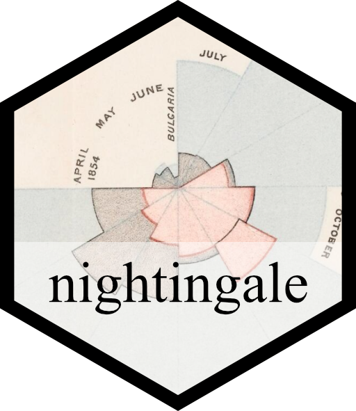

# nightingale 

<!-- badges: start -->
[](https://github.com/jansim/nightingale/actions/workflows/R-CMD-check.yaml)
<!-- badges: end -->

The goal of `nightingale` is to serve as a practical example to help you learn and try out practices of research software engineering.

## Installation

You can install the development version of nightingale from [GitHub](https://github.com/) with:

``` r
# install.packages("pak")
pak::pak("jansim/nightingale")
```

## Example

The package contains two main functions:

``` r
# It's important to first load the package, so that functions are available
library(nightingale)

# Display a static barplot illustrating the mortality data
show_barplot()

# Display an interactive shiny application
show_shiny_app()
```

## Docker

You can run the shiny app included in the package through a docker container via the following command:

```bash
docker run --rm -p 3838:3838 ghcr.io/jansim/nightingale:latest
```

This will start the shiny app and make it available at [https://localhost:3838/](https://localhost:3838/).

> [!TIP]
> The `--rm` flag means that the container will be removed immediately after you stop it (you might still want to delete the container *image*, though) and `-p` (short for `--expose`) means that port 3838 from the container will be exposed and reachable from the outside.

## Acknowledgement

The package uses data and draws inspiration from https://www.datawrapper.de/blog/recreating-nightingale-rose-chart.
